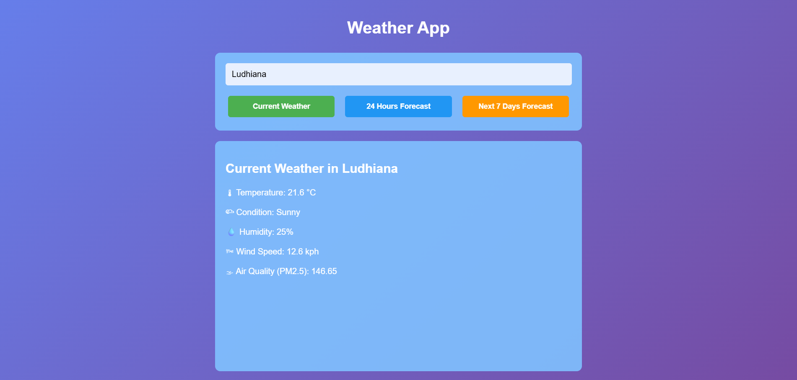

# 🌦 Weather Forecast Web App
A modern, responsive **Weather Forecast Web Application** built with **Dash (Python)** and powered by **WeatherAPI.com**. This application allows users to search for any city worldwide and instantly view **current weather conditions**, a **24-hour hourly forecast**, and a **7-day weather forecast** through a clean and intuitive interface.

---

## ✨ Features
- 🌍 Search weather by city name (global coverage)
- 🌡 Current weather conditions
- ⏱ 24-hour hourly weather forecast
- 📅 7-day weather forecast
- 🌫 Air quality information (PM2.5)
- 🎨 Clean gradient-based UI with smooth interactions
- 🔐 Secure API key management using environment variables
- 🧼 CSS separated into assets for maintainability

---

## 🖥️ Application UI Preview


---

## 🛠 Tech Stack
- **Python**
- **Dash** – Web application framework
- **WeatherAPI.com** – Weather data provider
- **Requests** – HTTP client for API calls
- **python-dotenv** – Environment variable management
- **HTML / CSS** – Frontend styling

---

## 📁 Project Structure
```text
├── app.py              # Main Dash application file (UI, callbacks, API integration)
├── requirements.txt    # List of Python dependencies required to run the project
├── .env.example        # Sample environment variables file (no secrets)
├── .gitignore          # Specifies files and folders Git should ignore (e.g., .env)
└── assets/
    └── style.css       # External CSS file for styling the Dash application
    └── WeatherApp.png  # Output Screenshot
```

---

## 🚀 Getting Started
Follow the steps below to run the project locally.

### 1️⃣ Clone the Repository
```bash
git clone https://github.com/<your-username>/Weather-App.git
cd Weather-App
```

### 2️⃣ Create and Activate a Virtual Environment (Recommended)
```bash
python -m venv venv
source venv/bin/activate        # macOS/Linux
venv\Scripts\activate           # Windows
```

### 3️⃣ Install Dependencies
```bash
pip install -r requirements.txt
```

### 4️⃣ Set Up Environment Variables
Create a `.env` file using the provided example:
```bash
cp .env.example .env
```

Edit the .env file and add your WeatherAPI.com API key:
```bash
WEATHERAPI_KEY=your_weatherapi_api_key_here
```

🔑 Get a free API key from https://www.weatherapi.com/

### 5️⃣ Run the Application
```bash
python app.py
```

Open your browser and navigate to:
http://127.0.0.1:8050

---

### 🔐 Security & Best Practices
- .env files are never committed to GitHub
- .env.example is included to document required environment variables
- API keys are securely loaded using python-dotenv
- .gitignore prevents accidental exposure of sensitive data

---

### 🌟 Why This Project?
This project demonstrates:
- Real-world API integration
- Secure handling of sensitive credentials
- Clean separation of frontend and backend logic
- Production-ready Python web development practices
- A solid foundation for building advanced weather applications
- It is well-suited for learning, portfolio showcasing, and further extension.

---

### 🧩 Future Enhancements
- 📊 Weather charts and visualizations
- 🔍 City autocomplete and suggestions
- 📍 Automatic location detection
- ☁ Weather icons and animations
- 🚀 Cloud deployment (Render / Railway / Docker)

### 📜 License
This project is open-source and available for learning and personal use.

### 🙌 Acknowledgements
- Weather data provided by WeatherAPI.com
- Built using Dash by Plotly
